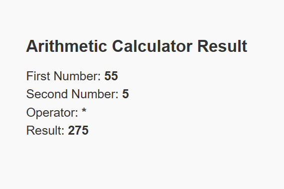
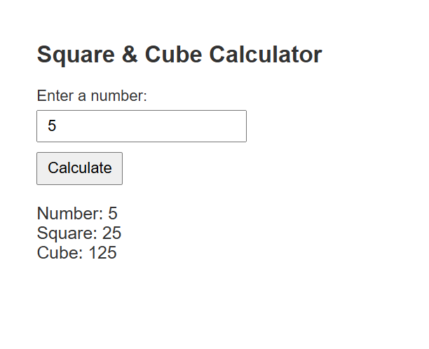
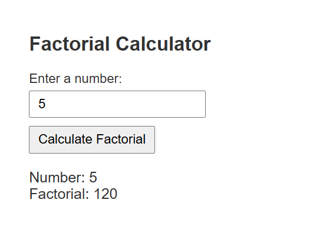
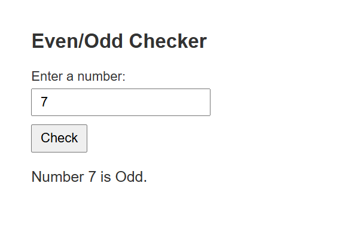

<h2 style="color: darkblue;">Calculator Outputs</h2>

<h3 style="color: darkgreen;">1. Arithmetic Calculator Output</h3>

<h3 style="color: darkgreen;">2. Square & Cube Calculator Output</h3>

<h3 style="color: darkgreen;">3. Factorial Calculator Output</h3>

<h3 style="color: darkgreen;">4. Even/Odd Checker Output</h3>

